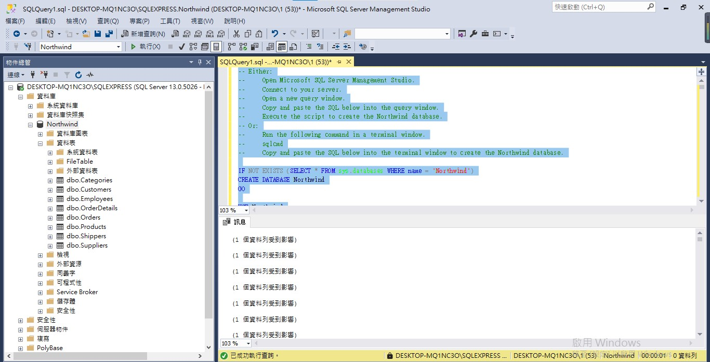
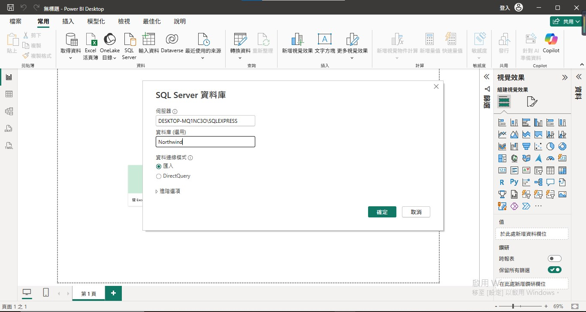
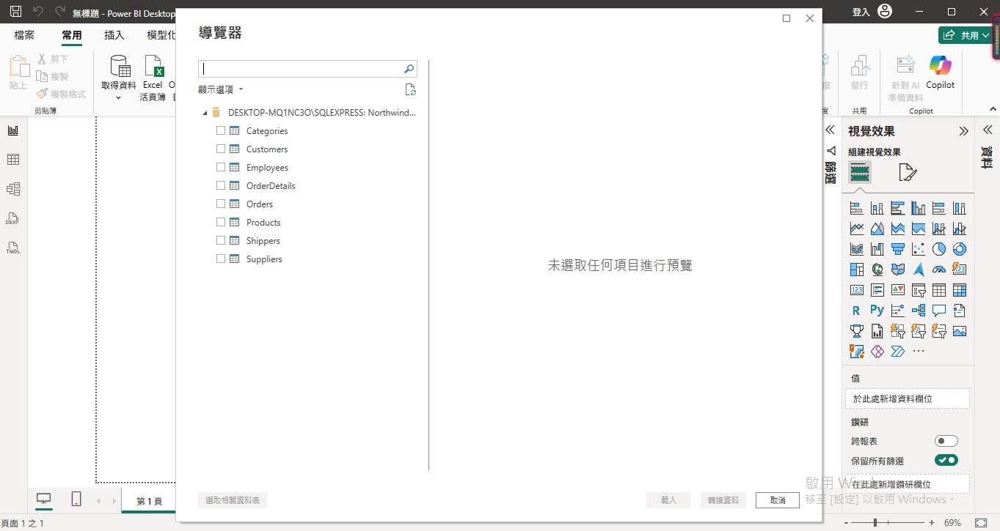
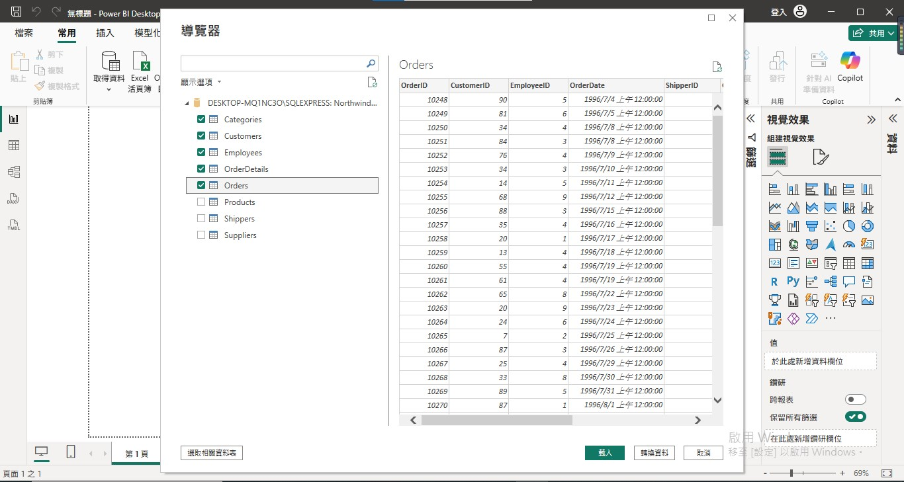
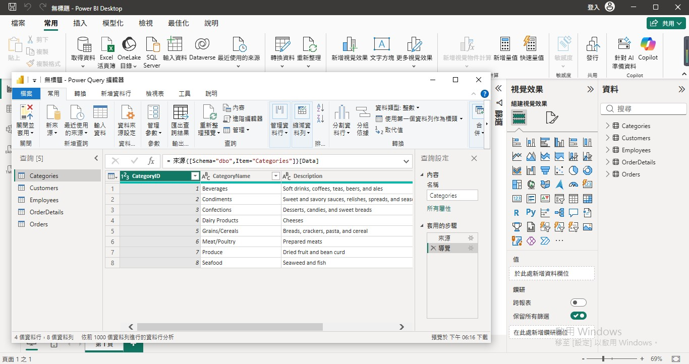
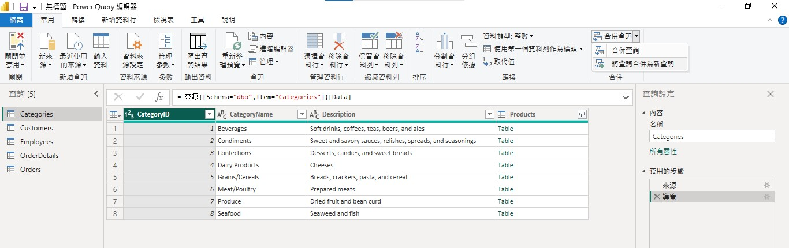
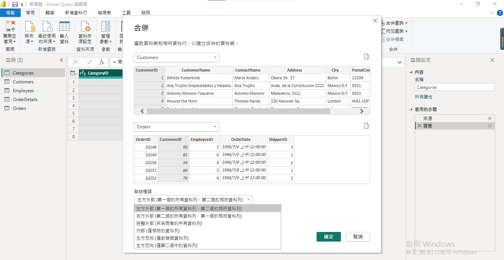
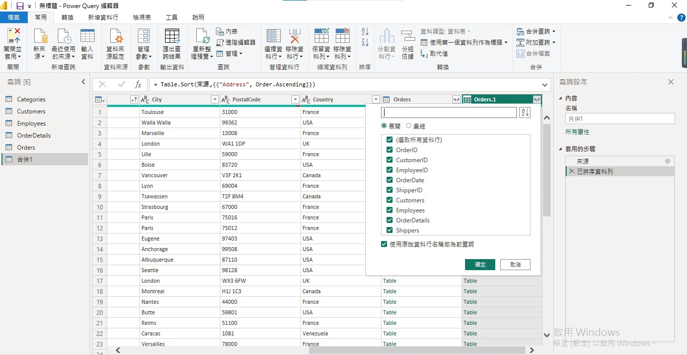

# 第2次隨堂題目-隨堂-QZ2
>
>學號：112111113
> 
>姓名：林品承
>

本份文件包含以下主題：(至少需下面兩項，若是有多者可以自行新增)
- [x] 說明內容

# 1.

Ans:  

首先開啟 MSSQL 資料庫，進入後，創建一個名為Northwind的資料庫，並利用新增查詢將[北風資料庫](https://en.wikiversity.org/wiki/Database_Examples/Northwind/SQL_Server)此網址內的指令複製過來並執行，就會出現以下畫面：

 再來開啟 POWER BI ，點選常用→ SQL Server，會出現如下圖的畫面，伺服器的欄位要填寫自己 MSSQL 的伺服器名稱；資料庫的欄位則填上 Northwind ，如下：

 點擊確定後，會跳出以下導覽器的視窗，會顯示出 Northwind 資料庫的所有資料表，如下圖：

 在這邊選取前五項的資料表，同時可檢視各資料表的資料內容，如下圖：

 點擊匯入後，即可查看最右側資料的這個欄位成功顯示所匯入的資料，點擊每個資料表的編輯查詢，就會顯示資料表的內容，並可進行後續相關操作，如下圖：

# 2. 

Ans: 
首先，在常用→合併查詢的地方，選擇點擊「將查詢合併為新查詢」，如下圖：

 上述點擊後，會跳出以下合併的這個畫面，並有顯示兩個可以選擇的資料表及資料表欄位，在這個部分按照投影片，第一個資料表選擇為 Customers ，並全選CustomersID 欄位；第二個資料表選擇為 Orders ，並全選CustomersID 欄位；以及在下方連結種類部分，選擇預設「左方外部(第一個的所有資料列、第二個的相符資料列)」，如下圖：

 點擊確定後，即完成合併查詢。在新合併出的資料列標題後方可以點擊展開，就可看到所有的選取資料行，如下圖：

